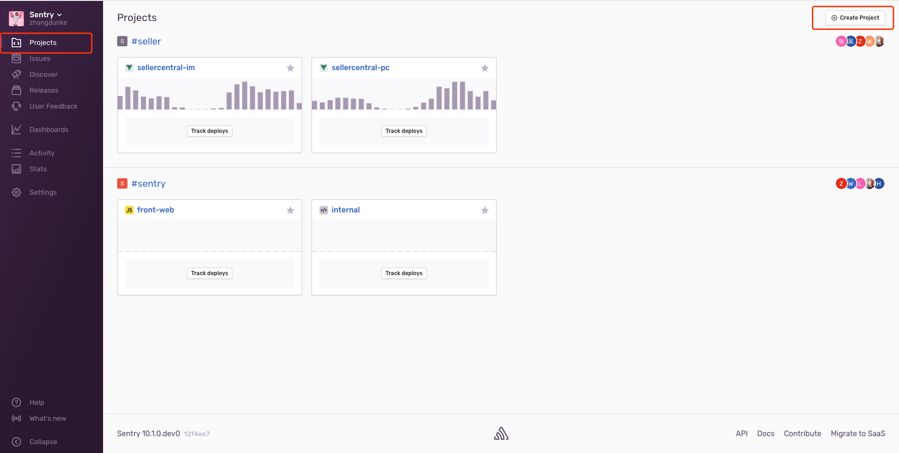
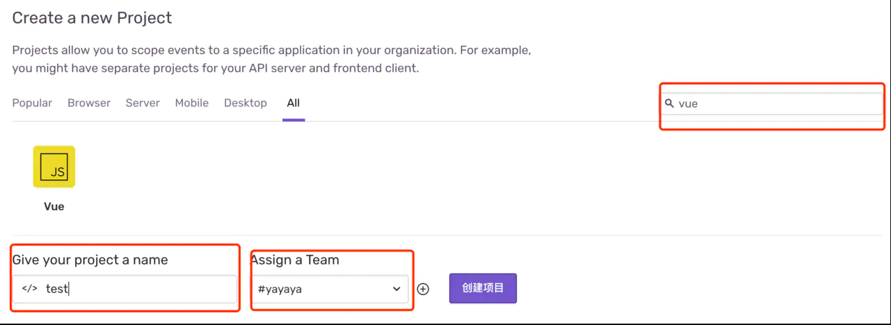

## 为什么需要sentry

JS没有如后端一样完善的日志系统，因此线上的各种bug都难以迅速定位。在加入错误日志工具前，每次报告bug都要麻烦用户协助开发人员进行定位，一方面对用户极不友好，另一方面也加大了Bug定位的难度。因此我们需要一个工具来帮我们收集错误信息，如接口报错，dom报错以及语法错误等。下面我就介绍一下sentry这个工具如何在项目中使用。

## 创建项目

1. 新建一个项目，点击左边菜单栏Projects,选择Create Projects,进入创建项目



sentry 支持多种框架，我们的项目的框架是vue,所以在其中选择 `vue`。我创建了一个名为test的项目。



## 项目工程里面引入sentry

1. 创建project完成后会自动跳转到如何配置vue项目页面。接下来就按照指引在vue代码里引入 `sentry`。可以通过 `cdn` 或者 `npm` 引入。我们采用 `npm` 引入。引入的时候需要给 `init` 函数传递一个 `dsn` 参数。这个参数唯一指定了我们刚才创建的项目，在创建项目的时候系统会自动生成。如果不传这个参数，`sentry` 不会发送错误

```javascript
import Vue from 'vue'
import * as Sentry from '@sentry/browser';
import { Vue as VueIntegration } from '@sentry/integrations';

Sentry.init({
   dsn: '自己项目的dsn',
   integrations: [
     new Integrations.Vue({Vue, attachProps: true}),
   ],
   environment: process.env.VUE_APP_MODE,
   })
```

2. 在项目根目录下增加.sentryclic文件，其中的token可以在左上角头像里的api keys里面获取

```
[defaults]
url = https://raven.clubfactory.com
org = sentry
project = sellercentral-pc
apiKey = "your token"

[auth]
token = "your token"

[http]
keepalive=false

```


## sourceMap release version 上传
现在的前端项目基本都会使用工具进行编译打包压缩等（webpack）。那么，这样的代码在发布后一旦报错返回的源码可能你就很难找到具体位置在哪里了。目前已知的有两种方式，webpack插件Sentry Webpack Plugin和sentry-cli的方式。
### webpack配置上传源文件

1. 上传source-map文件

   目前来说，前端项目基本都会压缩混淆代码，这样导致Sentry捕捉到的异常堆栈难以理解。为了定位到错误的精确位置，我们需要把source和map文件上传到sentry服务器，这一步可以通过webpack插件[Sentry Webpack Plugin](https://github.com/getsentry/sentry-webpack-plugin)上传。
   
    安装Sentry Webpack Plugin插件，配置文件如下
   
   ```javascript
     const SentryCliPlugin = require('@sentry/webpack-plugin')
     module.exports = {
       plugins:[
         new SentryCliPlugin({
           include: './dist',
           ignoreFile: '.sentrycliignore',
           ignore: ['node_modules', 'webpack.config.js'],
           configFile: '.sentryclirc',
           urlPrefix: 'http:' + process.env.VUE_APP_CDN_URL, // 静态文件地址
           release: 'release@1.0.0' //release版本号
         }),
       ]
     }
   ```
   
     配置好后sentry后台错误信息展示效果
   
   

2. 配置项目的release版本号

   上传的sourece-map通过realease来标注版本,这样在多版本的监控中可以对错误信息进行过滤.
由于Sentry服务是依赖release版本号区分map文件的，因此需要确保版本号对应和唯一性，采用方法是在打包运行的时候获取到当前的时间戳并赋值给了一个全局变量。使用webpack自带的插件DefinePlugin即可实现，修改如下：

   ```javascript
   const SentryCliPlugin = require('@sentry/webpack-plugin')
   const SENTRY_RELEASE = JSON.stringify(Date.now())
   
   module.exports = {
     plugins:[
       new webpack.DefinePlugin({
         SENTRY_RELEASE: SENTRY_RELEASE
       }),
       new SentryCliPlugin({
         include: './dist',
         ignoreFile: '.sentrycliignore',
         ignore: ['node_modules', 'webpack.config.js'],
         configFile: '.sentryclirc',
         urlPrefix: 'http:' + process.env.VUE_APP_CDN_URL, // 静态文件地址
        	release: process.env.VUE_APP_MODE + VERSION // release版本号
       }),
     ]
   }
   ```

   项目引入sentry的地方release保持一致
   
   ```javascript
      Sentry.init({
       dsn: 'dsn',
       integrations: [
         new VueIntegration({ Vue, attachProps: true })
       ],
       environment: process.env.VUE_APP_MODE,
       release: process.env.VUE_APP_MODE + VERSION
       })
   ```
   
   Sentry发布的版本如下图所示：
   
   


3. 打包删除sourceMap文件

   但是如果在项目打包部署的时候把map文件一起上传到web服务器会造成非常大的安全隐患，所以我们需要在打包完成后删除map文件。可以在webpack中使用[Clean plugin for webpack插件](https://github.com/johnagan/clean-webpack-plugin)来删除。配置文件如下:

   ```javascript
   const {CleanWebpackPlugin} = require('clean-webpack-plugin');
   module.exports = {
      plugins:[
       new CleanWebpackPlugin({
         protectWebpackAssets: false,
         cleanAfterEveryBuildPatterns: ['**/js/*.map'],
       })
     ]
   }
   ```
   
   

4. 区分环境引入文件

   因为我们监控的是线上的错误，所以只要在生产环境下生效即可
   
   ```javascript
     const SentryCliPlugin = require('@sentry/webpack-plugin')
     const { CleanWebpackPlugin } = require('clean-webpack-plugin')
     module.exports = {
     configureWebpack: config => {
       const plugins = []
       // 区分环境引用plugin，只有线上才使用sentry服务器和删除map文件
         if (process.env.VUE_APP_MODE === 'production') {
           plugins.push(
             new SentryCliPlugin({
               include: './dist',
               ignoreFile: '.sentrycliignore',
               ignore: ['node_modules', 'webpack.config.js'],
               configFile: '.sentryclirc',
               urlPrefix: 'http:' + process.env.VUE_APP_CDN_URL, // 静态文件地址
               release: process.env.VUE_APP_MODE + VERSION // release版本号
             }),
             new CleanWebpackPlugin({
               protectWebpackAssets: false,
               cleanAfterEveryBuildPatterns: ['**/js/*.map']
             })
           )
         }
        config.plugins = [
           ...config.plugins,
           ...plugins
         ]
     }
     }
   ```
   
    
   
   这种方式有个弊端是项目打包时如果sentry服务出现问题，就会导致打包失败，阻塞打包流程。

### sentry cli方式上传源文件

1. sentry-cli 下载

   ```javascript
   npm install @sentry/cli
   ```


2. 命令上传

   在package.json里面npm script加上
   
   ```javascript
    {
    "scripts":{
       "sentry-cli": "VERSION=$(sentry-cli releases propose-version) && sentry-cli releases files $VERSION upload-sourcemaps --url-prefix '域名/项目名/js/' './dist/js'"
      }
    }
   
   ```
   
   这里的version是取得最近的一次提交的commitId


3. 异步执行，不阻塞打包流程

   在package.json里面npm script加上

   ```javascript
    {
    "scripts":{
       "postbuild:prod": "npm run sentry-cli; echo -n",
      }
    }
   ```
   
      npm脚本有pre和post两个钩子。用户执行npm run build的时候会按照下面的顺序执行:

   ```javascript
   npm run prebuild && npm run build && npm run postbuild
   ```
   
   所以我们在post的钩子里面加入执行sentry-cli，并且echo -n  的作用是，异步,不阻塞后面的 命令,所以这里能保证打包时不阻塞打包流程


4. 保证release一样

   在vue.config.js文件里加入,这个是得到最近的一次commitId，和指令上传的version保持一致

   ```javascript
   const gitSha = require('child_process').execSync('git rev-parse HEAD').toString().trim()
   ```
   
   使用webpack的DefinePlugin插件，这个是在编译的时候创建一个全局变量
   
   ```javascript
   new webpack.DefinePlugin({
     VERSION: JSON.stringify(gitSha)
   });
   ```
   
   在项目配置sentry的时候,release的VERSION就和sentry-cli的VERSION对应一致了
   
   ```javascript
     Sentry.init({
       dsn: 'dsn',
       integrations: [
         new VueIntegration({ Vue, attachProps: true })
       ],
       environment: process.env.VUE_APP_MODE,
       release: VERSION
     })
   ```
   
   


5. nginx配置,让map文件线上不能访问

   ```nginx
   location ~ \.map$ {
   	deny all;
   }
   ```
   
   

这个方式不阻塞打包流程，目前项目采用的是这个方式
