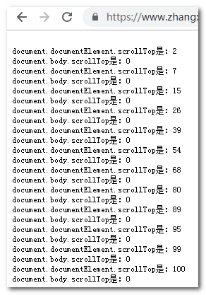
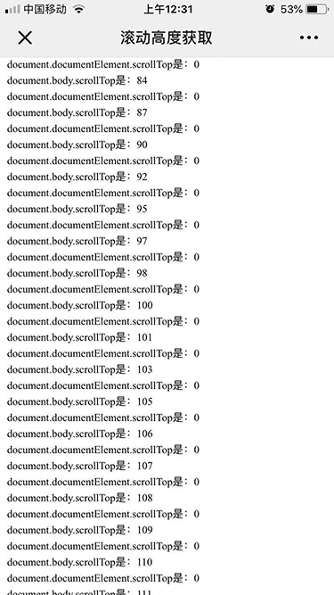

1. window.pageYOffset

   获取当前网页窗体的滚动高度，桌面端和移动端都支持，但是`window.pageYOffset`是一个只读属性，我们无法用来设置窗体的滚动高度，此时，就要找到对应的滚动元素，通过设置`scrollTop`值来改变窗体的滚动位置。

2. document.documentElement.scrollTop和document.body.scrollTop

   这两个都是获取当前网页窗体的滚动高度，也可以通过设置`scrollTop`值来改变窗体的滚动位置

   但是，桌面端和移动端的窗体滚动元素是不一样的，如下测试代码：

   ```javascript
   document.documentElement.scrollTop;
   document.body.scrollTop;
   ```

   在pc上访问时这样的：

   

   

   而手机上则是：

   

   - 桌面端浏览器`document.body.scrollTop`一直是0，说明桌面端滚动元素是`document.documentElement.scrollTop`
   - 移动端`document.docmentElement.scrollTop`一直是0，说明移动端滚动元素是`document.body.scrollTop`

   得到滚动高度，我们为了兼容移动端和桌面端会如此写

   ```javascript
   const scrollTop = document.documentElement.scrollTop || document.body.scrollTop
   ```

3. document.scrollingElement.scrollTop

   上面说了获取滚动高度在桌面端和移动端是不一样的，正是由于这种现状，`document.documentElement`应运而生，直接动态识别滚动容器。

   - 在桌面端`document.scrollingElement`就是`document.documentElement`
   - 在移动端`document.scrollingElement`就是`document.body`

   可以自动识别不同平台上的滚动容器

   于是当我们希望页面滚动定位到具体位置的时候，如400像素，直接一行代码就可以搞定了：

   ```javascript
   document.scrollingElement.scrollTop = 400;
   ```

   

4. document.documentElement.scrollHeight

   网页正文全文高度

5. document.documentElement.clientHeight

   可见区域的高度

